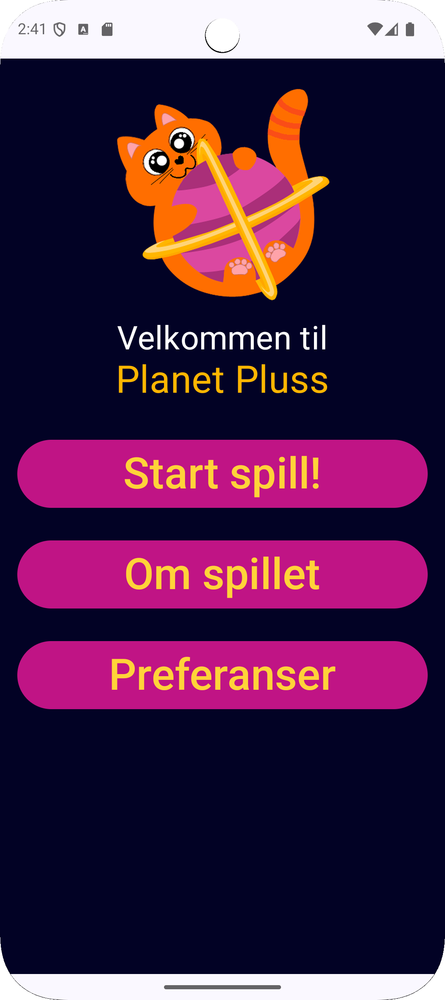
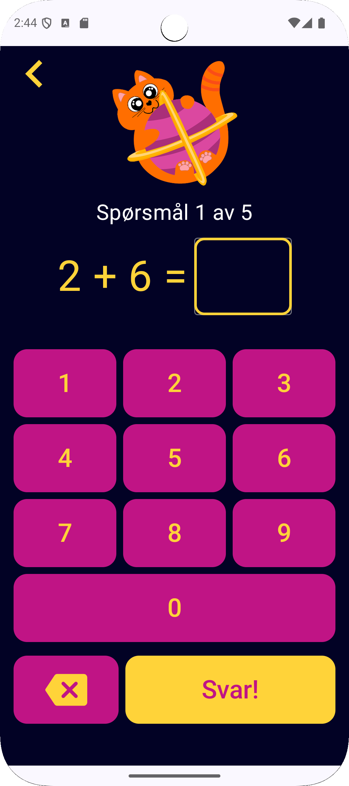
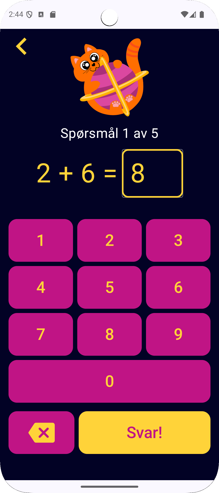
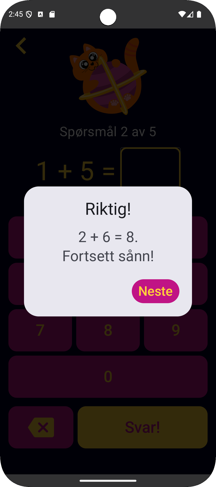
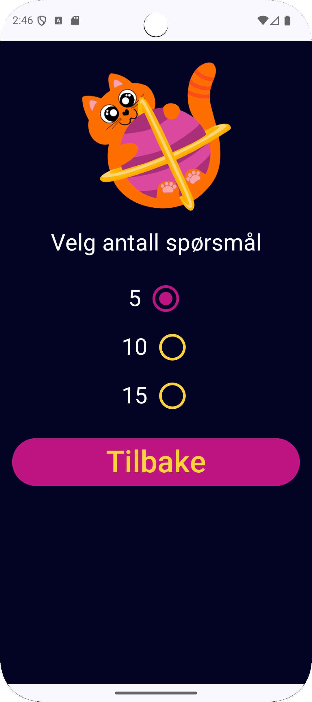

# Planet Pluss

Planet Pluss er en Android-app utviklet i Kotlin for å hjelpe barn med å lære addisjon gjennom spill.  
Brukeren får tilfeldige regnestykker og svarer via et talltastatur. Appen tilbyr enkle, fargerike skjermer tilpasset barn.

Begrunnelser for valg av teknologi, struktur og design finnes i `rapport.pdf` under `res/raw`.  
Appen utgjør én av tre innleveringer i mappeeksamen i emnet DATA3600 Apputvikling ved OsloMet.

Prosjektet er utviklet som en del av et læringsforløp i Android-utvikling.  
Enkelte deler av implementasjonen kan derfor være forenklet eller mangle videre optimalisering.  

## Funksjoner

- Velg mellom 5, 10 eller 15 spørsmål per runde
- Tilfeldige regnestykker der ingen spørsmål gjentas i samme runde
- Støtte for norsk og tysk (avhenger av enhetens språkinnstilling)
- Brukerens innstillinger lagres med SharedPreferences
- ViewModel sørger for stabil state-håndtering ved skjermrotasjon
- Laget med Jetpack Compose for et dynamisk og reaktivt brukergrensesnitt
- Eget design inspirert av verdensrom og læring

## Arkitektur

Appen er bygget med en klar separasjon mellom:
- UI-laget (Composable-funksjoner) som viser grensesnitt og håndterer brukerinteraksjon
- ViewModel-laget som håndterer spilltilstand, logikk og data

Denne arkitekturen gjør appen stabil og enkel å vedlikeholde, selv ved livssyklusendringer som skjermrotasjon.

## Skjermbilder

### Hjem-skjerm

 

### Spillskjerm

  
  
  

 

### Preferanser

